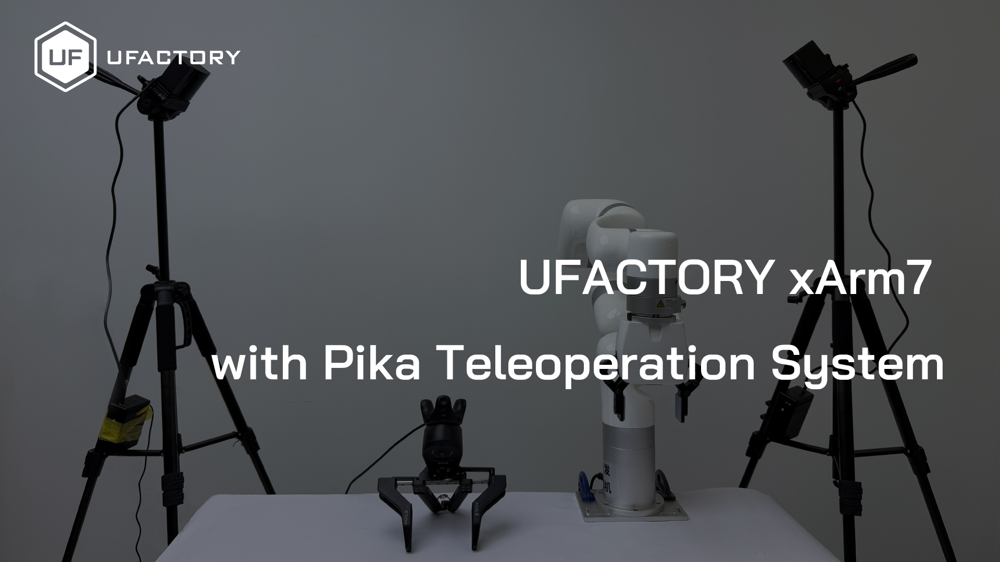

# Pika Teleoperation System

Use Agilex Robotics' Pika Sense (https://global.agilex.ai/products/pika) for teleoperation control of UFACTORY's robotic arms (https://www.ufactory.cc/xarm-collaborative-robot/).

GitHub: https://github.com/xArm-Developer/ufactory_teleop


[](https://www.youtube.com/watch?v=D4L1dyyBriA)

## System Requirements

### Operating System
- **Supported**: Ubuntu 22.04/Ubuntu 24.04
- **Not supported**: Windows/Mac OS

### Python Version
- Python 3.8/3.9/3.10

### Hardware Requirements
- UFACTORY xArm robotic arm (xArm 5/6/7, Lite 6 or 850)
- Pika Sense

## Installation

### 1. Download the Project

```bash
git clone https://github.com/xArm-Developer/ufactory_teleop
cd ufactory_teleop/pika_teleop
```

### 2. Create Virtual Environment and Install Dependencies

Create virtual environment (recommended)
```bash
python3.9 -m venv py39
```
Activate virtual environment
```bash
source py39/bin/activate
```

Install dependencies
```bash
pip install -r requirements.txt
pip install pysurvive
pip install pika
```

## Usage

### Basic Usage

```bash
python uf_robot_pika_teleop.py <robot_ip> [robot_mode] [gripper_type]
```

### Parameter Description

#### Required Parameters
- `robot_ip`: IP address of the robotic arm, e.g., 192.168.1.200

#### Optional Parameters

**robot_mode** (default: 7)
- `1`: Servo motion mode
- `7`: Cartesian online trajectory planning mode (recommended)

**gripper_type** (default: 0)
- `0`: No gripper
- `1`: xArm Gripper
- `2`: xArm Gripper G2
- `3`: BIO Gripper G2

### How to Use

#### 1. Set Permissions For USB
You need to set the read and write permissions for the USB. The following command can automatically configure this. Please replug the USB after running the command.
```bash
sudo cp 81-vive.rules /etc/udev/rules.d/
sudo udevadm control --reload-rules && sudo udevadm trigger
```

#### 2. Tracking Device Calibration

First-time use of Pika Sense or when the base station position changes requires calibration.

* Method 1: Use survive-cli.py for calibration [Recommended]
1. Run the example in libsurvive repository：
```bash
git clone https://github.com/collabora/libsurvive.git
cd libsurvive/bindings/python/examples
python example.py 
```

Example output:
```bash
Info: Loaded drivers: GlobalSceneSolver, HTCVive
Info: Adding tracked object WM0 from HTC
Info: Device WM0 has watchman FW version 1592875850 and FPGA version 538/7/2; named '                       watchman'. Hardware id 0x84020109 Board rev: 3 (len 56)
Info: Detected LH gen 2 system.
Info: LightcapMode (WM0) 1 -> 2 (ff)
Info: Adding lighthouse ch 1 (idx: 0, cnt: 1)
Info: OOTX not set for LH in channel 1; attaching ootx decoder using device WM0
Info: Adding lighthouse ch 0 (idx: 1, cnt: 2)
Info: OOTX not set for LH in channel 0; attaching ootx decoder using device WM0
Info: (0) Preamble found
Info: (1) Preamble found
Info: Got OOTX packet 0 bdeb5b80
Info: Got OOTX packet 1 36df43d7
Info: MPFIT success 1093702.051384/52.2148055877/0.0001598 (21 measurements, 1, MP_OK_CHI, 5 iters, up err 0.0002584, trace 0.0000177)
Info: Global solve with 1 scenes for 1 with error of 1093702.051384/52.2148055877 (acc err 0.0003)
Info: Using LH 1 (bdeb5b80) as reference lighthouse
LH1: T: 1761879738.310068 P:  0.000000, 0.583524, 0.721219 R: -0.445283,-0.223126,-0.379739,-0.779574
WM0: T: 1761879738.470426 P: -0.012316,-0.005824,-0.008128 R:  0.165526, 0.956895, 0.235385, 0.039320
WM0: T: 1761879738.474582 P: -0.012323,-0.005919,-0.008163 R:  0.166495, 0.956762, 0.235292, 0.039036
```

2. Run calibration command
```bash
python survive-cli.py
```

Example output:

```bash
Info: Loaded drivers: GlobalSceneSolver, HTCVive
Info: Adding tracked object WM0 from HTC
Info: Device WM0 has watchman FW version 1592875850 and FPGA version 538/7/2; named '                       watchman'. Hardware id 0x84020109 Board rev: 3 (len 56)
Info: Detected LH gen 2 system.
Info: LightcapMode (WM0) 1 -> 2 (ff)
Info: OOTX not set for LH in channel 1; attaching ootx decoder using device WM0
Info: OOTX not set for LH in channel 0; attaching ootx decoder using device WM0
Info: MPFIT success 7032214.017596/263.9077546656/0.0001747 (53 measurements, 1, MP_OK_CHI, 167 iters, up err 0.0026960, trace 0.0001336)
Info: Global solve with 1 scenes for 0 with error of 7032214.017596/263.9077546656 (acc err 0.0025)
Info: Global solve with 1 scenes for 1 with error of 7032214.017596/263.9077546656 (acc err 0.0034)
Info: Using LH 0 (36df43d7) as reference lighthouse
```


* Method 2: Use ROS commands for calibration (for ROS1/2 developers)

Reference: https://agilexsupport.yuque.com/staff-hso6mo/peoot3/axi8hh9h9t2sh2su

#### 3. Teleoperation Example: Using Cartesian online planning mode with gripper
```bash
python uf_robot_pika_teleop.py 192.168.1.100 7 1
```

* Start teleoperation: Quickly open/close the Pika Sense gripper 2 times. Note that the pose and orientation of Pika Sense at startup will be used as the initial pose and orientation of the robotic arm.
* End teleoperation: Quickly open/close the Pika Sense gripper 2 times.